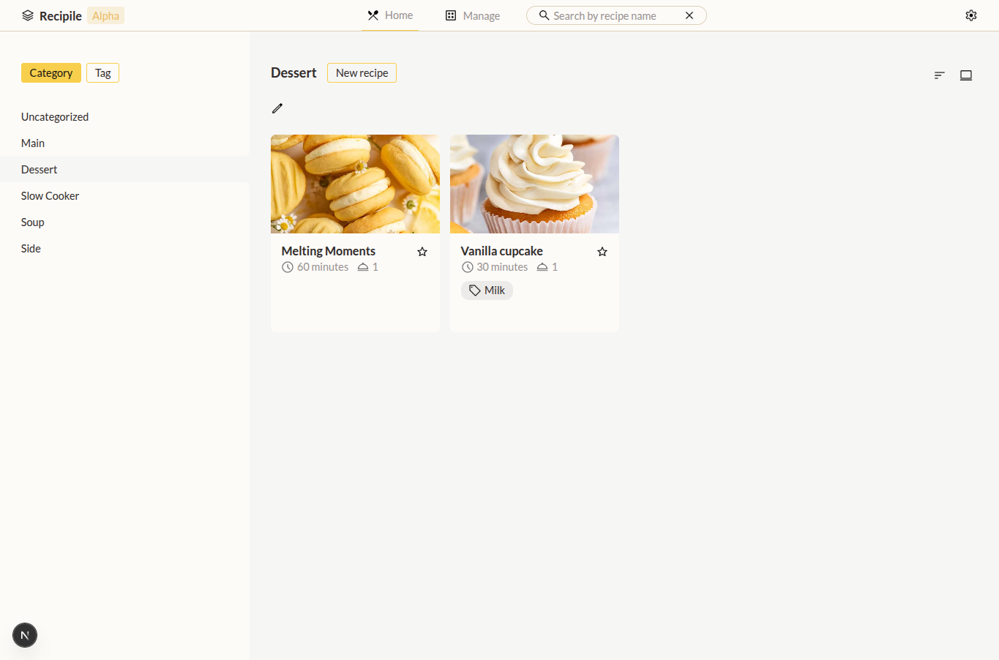
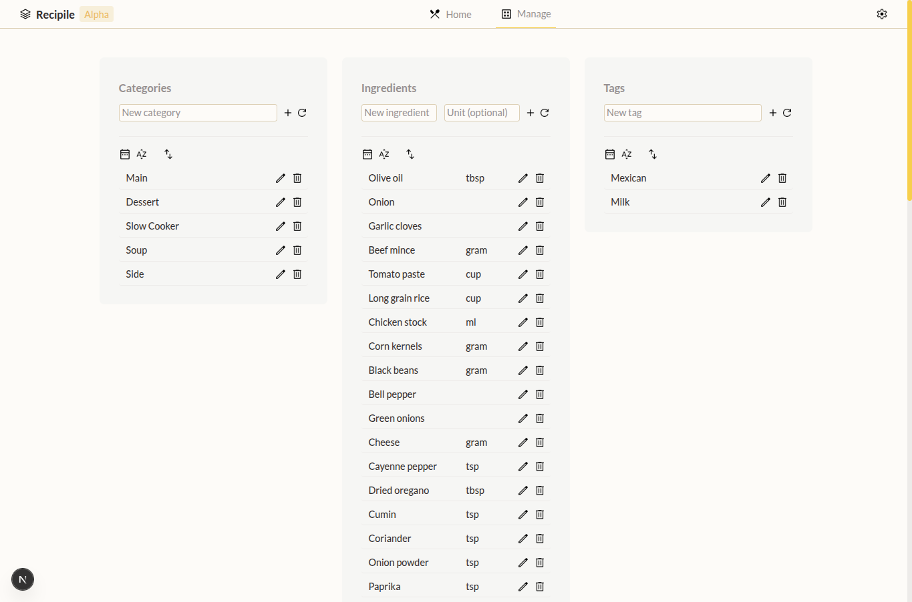

Recipile is an app for recipe collection and management.

<!-- 
.png)
.png)
 -->

|          |          |
|----------|----------|
|    | .png)  |
| .png)    |   |


## Features

### Main features

- Collect and manage recipes
- A management system for categories, tags, and ingredients
- Import data from `.json` files
- Export to `.csv` and `.json`

### Experience booster

- Customizable themes
- Bookmark favourite recipes
- Filter recipes with categories and tags
- Recipe search
- Responsive UI


## Run the app

### Local setup guide

Run the following commands in `/backend` directory
```
python3 -m venv .venv
. .venv/bin/activate
pip install -r requirements.txt
flask run
```

Run the following commands in `/frontend` directory
```
npm i
npm run dev
```

### Import the starter file

1. Click the setting button and go to "Data management" option
2. Under the "Import data" section, click the "Recipes" button
3. Import the file `starter-recipe.json` from the project root directory


## Contribution guide

TBD


## Credits

Icons
- [Material Symbols & Icons - Google Fonts](https://fonts.google.com/icons)


## Community and feedback

[Discord](https://discord.gg/Unae5A57)